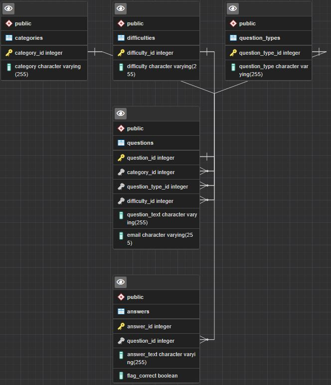

# Milestone Project 2

This was a group project done as part of the Kansas State University Software Development program. It is meant to put into practice skills learned in courses 6 (Back-end Development & APIs), 7 (React & Redux), and 8 (SQL & data Modeling)

## Deployment

This project is deployed on Netlify at the following [Link](https://astonishing-profiterole-3abd38.netlify.app/).

## Table of Contents

- [Description](#description)
- [ERD](#erd)
- [Wireframe](#wireframe)
- [Mockup](#mockup)
- [Technology](#technology)
- [Install & Run](#install)
- [Usage](#usage)
- [Sources](#sources)
- [Credits](#credits)
- [Issues](#issues)
- [Work In Progress](#WorkInProgress)

## Project Description
This is a fullstack application using express and react on the frontend, and node.js on the backend. It is a trivia game, which you can add your own questions to. 
## ERD

## Wireframe

## Mockup

## Technology

- ElephantSQL
- React
- Netlify
- Express
- React
- Node.js

## Technical information
 After cloning run "npm install" in the terminal
 To start the application, run "npm start"

### Click to play:
[Play](https://joyful-blancmange-178501.netlify.app/)

## Sources

### Back_End:

#### A database on ElephantSQL with data populated from Open Trivia Database. 

(http://elephantsql.com/)

#### ElephantSQL the config.json file to sent a pull request for is already setup to hit the server/database when you npm start.

(https://www.elephantsql.com/docs/pgadmin.html)

#### Learning to fetch our date from a path file and not via a URI 

(https://www.pluralsight.com/guides/fetch-data-from-a-json-file-in-a-react-app) 

#### YouTube tutorial on how to fetch data by localhost and how to fetch in react section. 

(https://www.youtube.com/watch?v=qdCHEUaFhBk)

#### Fetch API-Sending Form data

(https://www.youtube.com/watch?v=c3qWHnJJbSY)

#### Guide to generate any random data

(https://json-generator.com/)

### Front_End:

#### Beginner’s react tutorial on how to build a quiz app.

(https://www.freecodecamp.org/news/how-to-build-a-quiz-app-using-react/)

#### How to run Front End and Backend together in react.js

(https://dev.to/tradecoder/how-to-run-front-end-and-backend-together-in-react-js-and-express-js-with-concurrently-package-5fga)

### Additional Resources:

Instructors Chance Embrey and Aram Hammoudeh

### Credits
Made by:
- [Benjamin Froehlich](https://www.linkedin.com/in/benjamin-froehlich-934650a2/)
- [Braxton Allen ](https://www.linkedin.com/in/bnallen)
- [Scott Andrew Green](https://www.linkedin.com/in/sagreenxyz)
- [Bertha Zhao](https://www.linkedin.com/in/bertha-zhao-21653b91/)       

### Issues
#### While working as a team, being in constant communication is key. We did run into a merge issues with our branches.
### What we learned:
- When working as a team, make sure to work in the latest version of the repository.
- Connecting the Front-End with Back-End.
- Running Back-end and Front-end syncronized.
- Couldn't get the answers to shuffle.
- We need to clean up the repository and remove unnecessary files.

